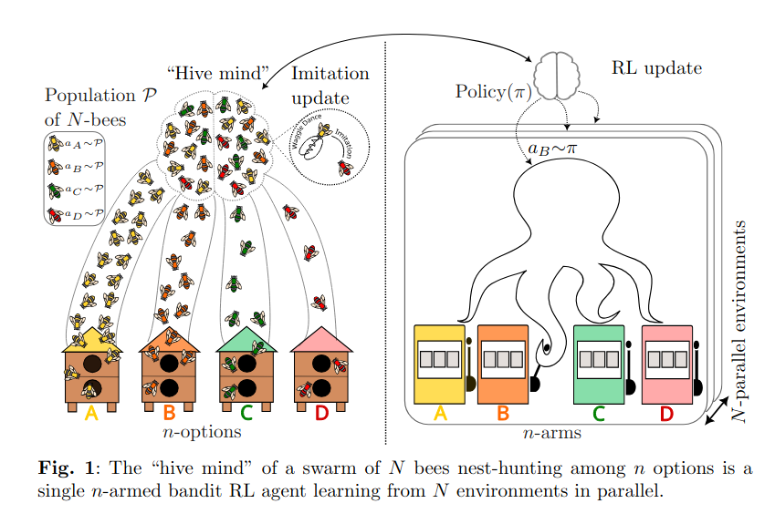

#  HiveMindRL 🐝🤖

## Abstract ✨

This project introduces a novel method for swarm robotics...

Decision-making is an essential attribute of any intelligent agent or group.
Natural systems are known to converge to optimal strategies through at least two distinct mechanisms: collective decision-making via imitation of others, and individual trial-and-error.
This paper establishes an equivalence between these two paradigms by drawing from the well-established collective decision-making model of nest-hunting in swarms of honey bees.
We show that the emergent distributed cognition (sometimes referred to as the \textit{hive mind}) arising from individual bees following simple, local imitation-based rules is that of a single online reinforcement learning (RL) agent interacting with many parallel environments.
The update rule through which this macro-agent learns is a bandit algorithm that we coin \textit{Maynard-Cross Learning}.
Our analysis implies that a group of cognition-limited organisms can be equivalent to a more complex, reinforcement-enabled entity, substantiating the idea that group-level intelligence may explain how seemingly simple and blind individual behaviors are selected in nature.

From a biological perspective, this analysis suggests how such imitation strategies
evolved: they constitute a scalable form of reinforcement learning at the group
level, aligning with theories of kin and group selection. Beyond biology, the
framework offers new tools for analyzing economic and social systems where
individuals imitate successful strategies, effectively participating in a
collective learning process. In swarm intelligence, our findings will inform the
design of scalable collective systems in artificial domains, enabling
RL-inspired mechanisms for coordination and adaptability at scale.

